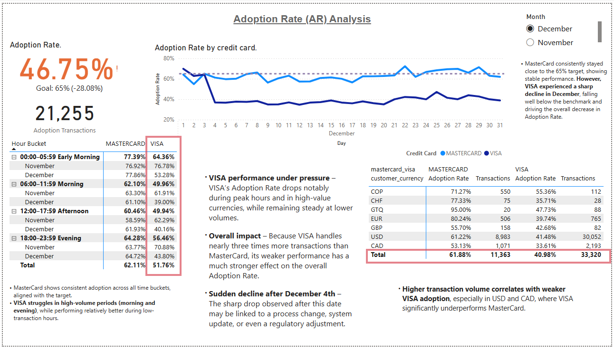
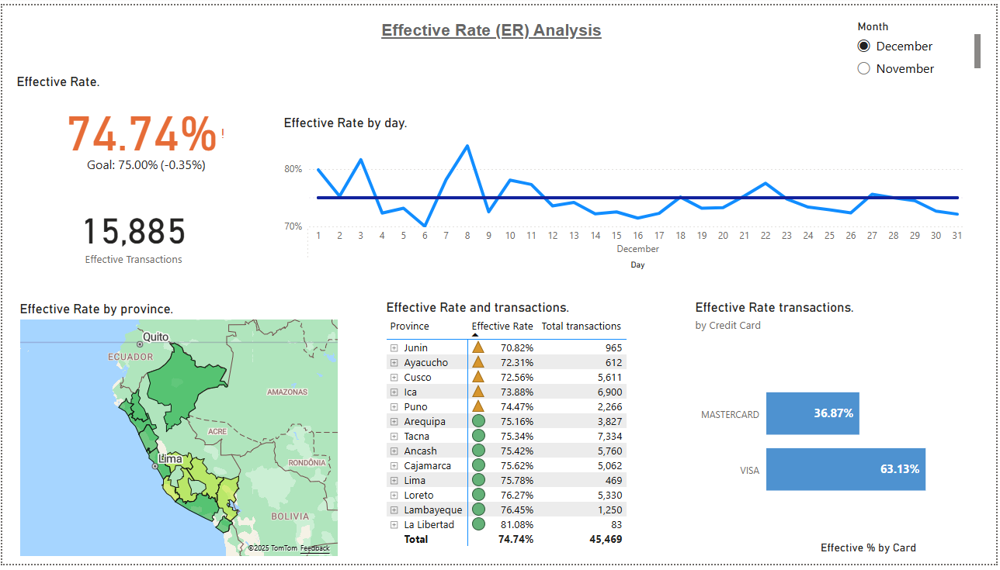

# Customer Decision Dashboard – Adoption & Effectiveness (Power BI)

### 🔍 Dashboard Preview (GIF)

## DESCRIPTION / DESCRIPCIÓN

## [Caso de Estudio] Panel de Decisiones CDD – Tasa de Adopción y Efectividad (Power BI)

### EN
This project presents a full analytical dashboard built in **Power BI** to evaluate the performance of the **CDD (Customer Decision Dashboard)** product from CIBC, using real testing data provided as part of an Analyst Case Study.

The goal was to assess **Adoption Rate (AR)** and **Effective Rate (ER)** of the product across 50 digital locations in Peru, identify root causes for lower-than-expected performance, and deliver clear, decision-ready insights.

This dashboard was developed and delivered within a **24-hour time limit**, as part of a selection process for a **Customer Insights & Reporting Analyst** role.

---

### ES
Este proyecto presenta un panel analítico desarrollado en **Power BI** para evaluar el desempeño del producto **CDD (Customer Decision Dashboard)** de CIBC, utilizando datos reales de prueba como parte de un caso de estudio para postulación.

El objetivo fue analizar la **Tasa de Adopción (AR)** y la **Tasa de Efectividad (ER)** del producto en 50 ubicaciones digitales en Perú, identificar las causas de la caída del rendimiento y entregar mensajes accionables para la toma de decisiones.

Este dashboard fue desarrollado y entregado en un plazo máximo de **24 horas**, como parte del proceso de selección para el cargo de **Customer Insights & Reporting Analyst**.

## CASE CONTEXT / CONTEXTO DEL CASO

### EN — Case Context
CIBC’s "CDD" product is offered to customers digitally across multiple countries. Each customer is presented a transaction screen where they can **accept** the product or decline it. Once a user accepts, the transaction can either **succeed** or **fail**, generating revenue only if successful.

As a BI Analyst candidate, I was asked to:
- Analyze two months of CDD transactions in Peru
- Identify why **AR and ER** underperformed
- Create a dashboard with key KPIs and findings
- Present a solution-focused narrative to the analytics team

---

### ES — Contexto del Caso
El producto "CDD" de CIBC se ofrece digitalmente a clientes en varios países. Cada cliente visualiza una pantalla transaccional donde puede **aceptar** o rechazar el producto. Si lo acepta, la transacción puede **ser exitosa** o **fallida**, generando ingresos solo si se completa con éxito.

Como parte del proceso de postulación a un rol de BI Analyst, se solicitó:
- Analizar dos meses de transacciones en Perú
- Identificar las razones de la baja en **AR y ER**
- Crear un dashboard con los KPIs clave y hallazgos
- Entregar una narrativa de análisis y soluciones a presentar al equipo

## TECH STACK / TECNOLOGÍAS UTILIZADAS

### EN — Tech Stack
- **Power BI**: data modeling, DAX, dynamic measures, conditional filters
- **Power Query**: ETL and transformation of transaction and location data
- **Excel**: source data and validation
- **DAX**: calculations for KPIs (AR, ER, error rates)
- **Map visual**: location-level performance insights
- **Time intelligence**: period comparison (Nov vs. Dec)
- **CAD revenue logic**: validated against transaction status

---

### ES — Tecnologías utilizadas
- **Power BI**: modelamiento de datos, DAX, medidas dinámicas, filtros condicionales
- **Power Query**: ETL y transformación de datos de transacciones y ubicaciones
- **Excel**: datos base y validaciones
- **DAX**: cálculos de KPIs (AR, ER, tasas de error)
- **Visualización en mapa**: análisis por ubicación/provincia
- **Inteligencia temporal**: comparación por períodos (noviembre vs diciembre)
- **Lógica de ingresos en CAD**: validada según estado de la transacción

## DATASET OVERVIEW / DESCRIPCIÓN DEL DATASET

### EN — Dataset Description
Two datasets were provided:
1. `trx_data.xlsx`: raw transactions (1 row = 1 transaction)  
   - Columns: `trx_id`, `trx_revenue`, `accept`, `successful`, `datetime`, `error_code`, `customer_currency`, etc.
2. `location_information.xlsx`: location details  
   - Columns: `location_id`, `country`, `province`, `city`, `lat/long`

Total duration: **Nov–Dec (2 months)**  
Total locations: **50 unique IDs** (across multiple cities in Peru)

---

### ES — Descripción del Dataset
Se entregaron dos archivos de datos:
1. `trx_data.xlsx`: transacciones crudas (1 fila = 1 transacción)  
   - Columnas: `trx_id`, `trx_revenue`, `accept`, `successful`, `datetime`, `error_code`, `customer_currency`, etc.
2. `location_information.xlsx`: información geográfica  
   - Columnas: `location_id`, `country`, `province`, `city`, `lat/long`

Período analizado: **noviembre y diciembre (2 meses)**  
Total de ubicaciones: **50 IDs únicos** (en distintas ciudades de Perú)

## KPI DEFINITIONS / DEFINICIÓN DE KPIs

### EN — KPIs Explained

#### Adoption Rate (AR)
> Proportion of transactions accepted over total transactions  
**Formula:** AR = Accepted / Total Transactions

#### Effective Rate (ER)
> Proportion of accepted transactions that were ultimately successful  
**Formula:** ER = Successful / Accepted

- Typical performance for Peru:
  - **AR:** ~65%
  - **ER:** ~80% (Nov) and ~75% (Dec)
- Actual performance was below target — root cause analysis was required.

---

### ES — Definición de KPIs

#### Tasa de Adopción (AR)
> Proporción de transacciones aceptadas sobre el total de transacciones  
**Fórmula:** AR = Aceptadas / Transacciones Totales

#### Tasa de Efectividad (ER)
> Proporción de transacciones aceptadas que finalmente fueron exitosas  
**Fórmula:** ER = Exitosas / Aceptadas

- Valores típicos esperados en Perú:
  - **AR:** ~65%
  - **ER:** ~80% (noviembre) y ~75% (diciembre)
- El rendimiento real estuvo por debajo del objetivo — fue necesario analizar la causa raíz.

# DASHBOARD & IMAGES / PANEL & CAPTURAS

## 📂 Power BI File / Archivo Power BI

🔹 **EN:** Download the full Power BI dashboard (.pbix)  
🔹 **ES:** Descarga el archivo completo de Power BI (.pbix)

---

## EN — Dashboard Overview  

The dashboard is organized across 4 pages:

1. **Adoption Rate (AR)** — November & December  
2. **Effective Rate (ER)** — November & December  
3. **Errors & Root Cause by Location**  
4. **Province Map — Performance by Region**  

---

## ES — Vista General del Dashboard  

El panel está organizado en 4 secciones:

1. **Tasa de Adopción (AR)** — Noviembre y Diciembre  
2. **Tasa de Efectividad (ER)** — Noviembre y Diciembre  
3. **Errores y Causas Raíz por Ubicación**  
4. **Mapa de Provincias — Desempeño por Región**  

---

## 📊 Dashboard Images / Capturas del Panel

### AR — November  
  

### AR — December  
  

### ER — November  
  

### ER — December  
  

## INSIGHTS / ROOT CAUSE ANALYSIS

### EN — Key Insights & Root Cause Analysis

#### 🔍 1. Adoption Rate (AR) dropped significantly in December
- **AR fell from 54.3% in November to 46.7% in December**, well below the expected ~65%.
- Drop is highly correlated with **VISA transactions**, which show the lowest adoption rate.
- **MasterCard maintains stable performance**, indicating the issue is specific to one payment type.

#### 🔍 2. Effective Rate (ER) declines are driven by error spikes
- **ER dropped from 72% (Nov) to 61% (Dec)** — both below expected thresholds (80% / 75%).
- Root cause: spikes in **error codes 2161, 3015, 3016, and 3030**, with highest frequency during December.
- These errors **cluster in 3 specific provinces**: Tacna, Arequipa, and Lima.

#### 🔍 3. Location-level patterns expose major variability
- Certain locations consistently outperform (e.g., Cusco), while others contribute to most rejected or failed transactions.
- **Location 39 and 17** stand out as highest-risk points: high accept but low success rates.

#### 💡 Business takeaway
- Most performance loss is tied to **payment type-specific acceptance behavior (VISA)** and **regional operational issues**.
- Targeted attention to payment partner and provincial errors could recover +12–15% performance.

---

### ES — Insights y Causa Raíz

#### 🔍 1. La Tasa de Adopción (AR) cayó notablemente en diciembre
- **AR bajó de 54,3% en noviembre a 46,7% en diciembre**, lejos del valor esperado (~65%).
- La caída está altamente asociada a las transacciones con **VISA**, que presentan la menor tasa de aceptación.
- **MasterCard mantiene un comportamiento estable**, lo que indica un problema específico por tipo de tarjeta.

#### 🔍 2. La Tasa de Efectividad (ER) disminuyó debido a un alza en errores puntuales
- **ER pasó de 72% (nov.) a 61% (dic.)**, por debajo de los niveles estándar (80% / 75%).
- Causa raíz: incremento en los **códigos de error 2161, 3015, 3016 y 3030**, especialmente en diciembre.
- Los errores se **concentran en 3 provincias**: Tacna, Arequipa y Lima.

#### 🔍 3. El desempeño por ubicación muestra alta variabilidad
- Algunas ubicaciones presentan rendimiento sólido (ej: Cusco), mientras otras concentran la mayoría de fallas.
- Las ubicaciones con mayor riesgo: **ID 39 y 17**, con alta aceptación pero baja efectividad.

#### 💡 Conclusión para el negocio
- La mayor pérdida de desempeño se debe a problemas **asociados al uso de VISA** y **errores regionales**.
- Mejoras focalizadas en el servicio asociado a VISA y en los puntos con fallo crítico podrían recuperar entre **12% y 15% de rendimiento**.

## 🚀 Future Improvements / Próximas mejoras

### EN — Future Improvements  
🔧 **Extend time period:** Add more months of data to enable trend analysis and seasonality insights.  
📊 **Drill-through pages:** Allow users to drill from summary KPIs into transaction-level details.  
📈 **Time series visuals:** Include YoY / MoM performance comparisons and forecasting.  
🔁 **Data refresh automation:** Connect source data to a live SQL source and publish in Power BI Service with scheduled refresh.  
🌍 **Country comparison:** Add dashboards for other regions (e.g., Chile, Colombia) to enable cross-market performance benchmarking.  
🤖 **Predictive analytics:** Train a classification model to predict transaction success or failure, reducing ER loss preemptively.

---

### ES — Próximas mejoras  
🔧 **Ampliar el período temporal:** Incorporar más meses de datos para habilitar análisis de tendencia y estacionalidad.  
📊 **Páginas de detalle (drill-through):** Permitir al usuario profundizar desde KPIs hasta el nivel transaccional.  
📈 **Visuales de series temporales:** Incluir comparaciones interanuales (YoY) y mensuales (MoM), así como pronósticos.  
🔁 **Automatización del refresco de datos:** Conectar los datos a una base SQL y publicar en Power BI Service con actualización programada.  
🌍 **Comparación entre países:** Agregar dashboards de otros mercados (ej: Chile, Colombia) para análisis comparativo.  
🤖 **Analítica predictiva:** Entrenar un modelo de clasificación que prediga éxito fallas de transacciones, reduciendo la pérdida de ER de forma anticipada.

## 📄 License

This project is licensed under the MIT License — free to use, modify, and distribute.

## 👨‍💻 About the Author / Sobre el Autor.

**Cristian Salinas** — Industrial Engineer & Data Analyst  
🔗 LinkedIn: https://www.linkedin.com/in/ingcrissalinas/  
🌐 Portfolio: https://www.ingsalinas.com/  
📂 GitHub: https://github.com/Crisfunky01

